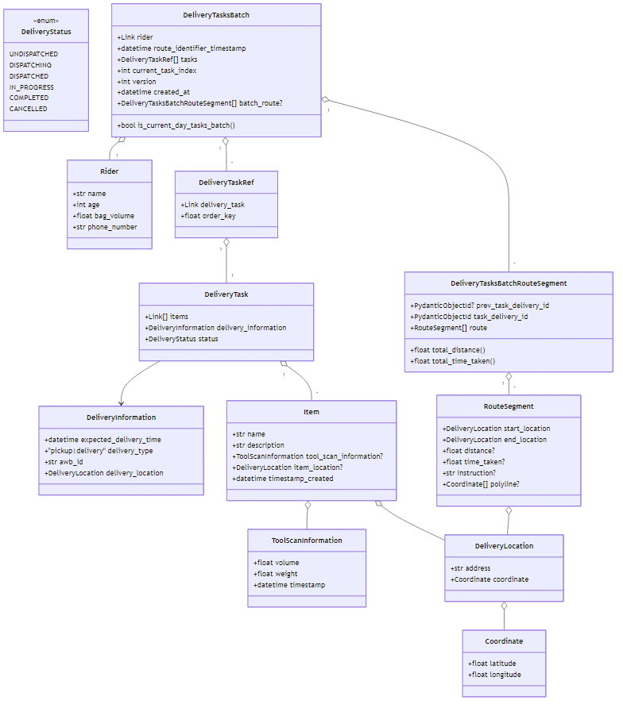
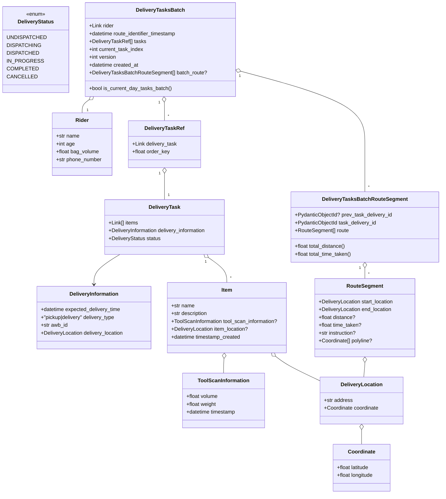
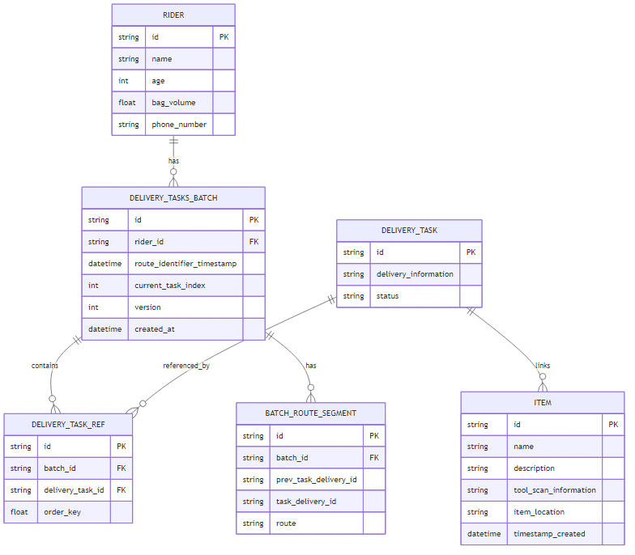
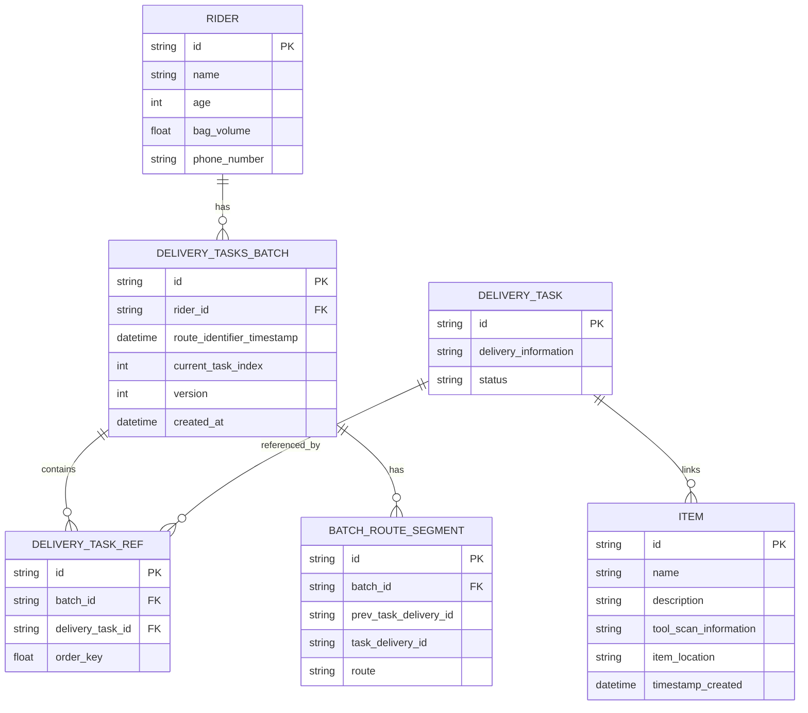

# Inter IIT'11 Grow Simplee's Route Planning for Optimized On-Time Delivery

###### This app is used to achieve Efficient On-Time Delivery and serve as a platform for warehouse managers and delivery personnels. It creates a space for the item scanning employees and warehouse managers to efficiently manage the scanning, logging, dispatch, and monitoring of goods from a single place. 

## Tech Stack used

1. Frontend : Next.js (Typescript)
2. Design   : TailwindCSS
3. Backend  : Python (FastAPI)
4. Database : MongoDB 

## Backend architecture diagrams

### Class design

### Database design (ER)

## Installation

### Requirements
1. Python 3.7+ 
2. pnpm 7.22.0+

### Steps to Reproduce (Backend)
1. `cd ./server/`
2. `pip install -r requirements.txt`
3. `uvicorn main:app`

### Steps to Reproduce (Frontend)
1. `cd ./app/`
2.  `pnpm install`
3.  `pnpm dev`

### Note to Developers
1. If you working with VSCode, we recommend you to install PostCSS Language Support

## Users of the app

The app has three types of users:

1. Item Scanning personnel
2. Warehouse managers
3. Delivery Riders

## Functional Requirements

###### Item Scanning personnel

1. As items are placed within the scanning tool, data received in the sensors will be fed to the application and will be visible on the web/app interface, along with the inferences regarding the item's information.

2. The scanner's task is to monitor the sensor data and approve the item currently visible on the interface. The item will then be added to the list of all previously scanned items.

3. Scanners may remove any item from this list at any point in time if they wish to do so.

4. Finally, once the final list of scanned items is ready, the scanner will have to submit it via the interface. This action will add the items to the database.

###### Warehouse Managers

1. The manager's dashboard will display the list of scanned items as well as the information about the riders for that day.

2. In case of any inconsistencies, the manager will be able to alter the information about any rider or item.

3. Upon clicking the "Dispatch" button, the routing algorithm will start running in the backend and will perform optimal clustering of items to riders, as well as finding the optimal route for each rider.

4. On the monitoring page, the manager will be able to view the current location of each rider and their projected route. 

5. We also support dynamic addition and removal of pickup points.

###### Delivery Riders

1. Each rider should be able to view the route they need to take in order to reach the next delivery/pickup point.
2. Riders will also be intimidated about the expected time within which the they should reach that location

## Other Requirements

1. Routing algorithm should be such that it maximizes the on time delivery percentage and minimizes overall
distance traveled. It should maximize the output of the riders by smart bag creation/clustering to get the best out of riders and routes.

2. Minimum time lag for communication between the app and the sensors as well as between the app and the routing algorithm.

3. Rider route navigation must mimic a real-world senario as closely as possible, with appropriate scaling down of the time taken for the rider to travel between to points, so as to represent a simulation-like environment.
